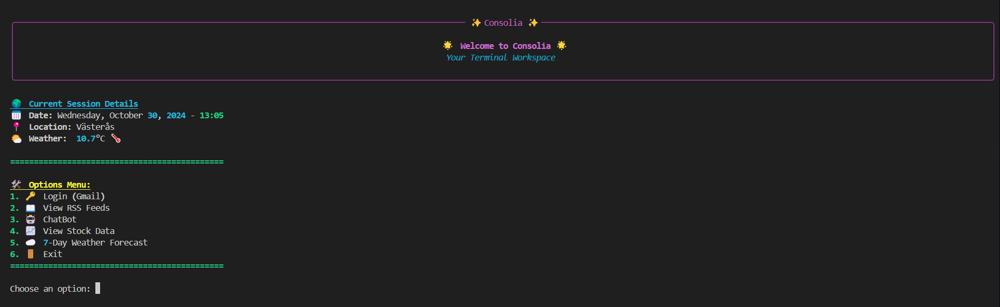
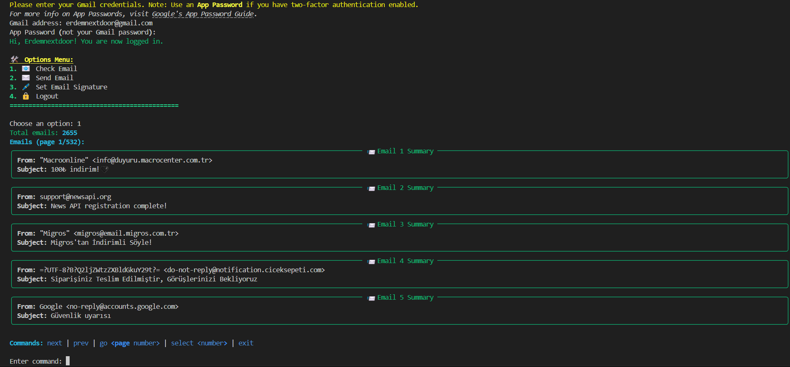
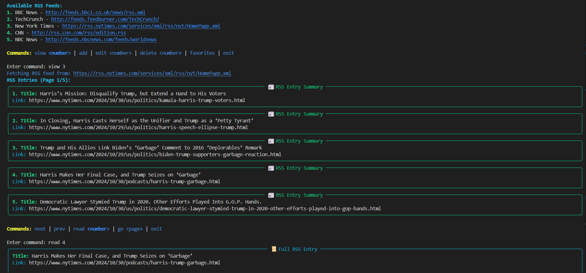
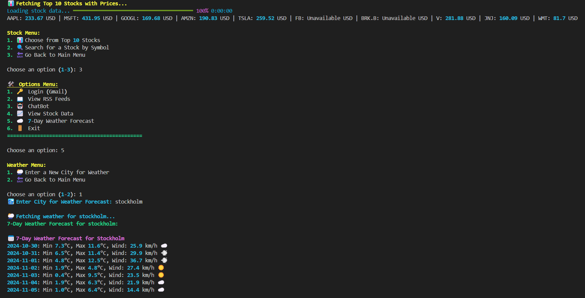
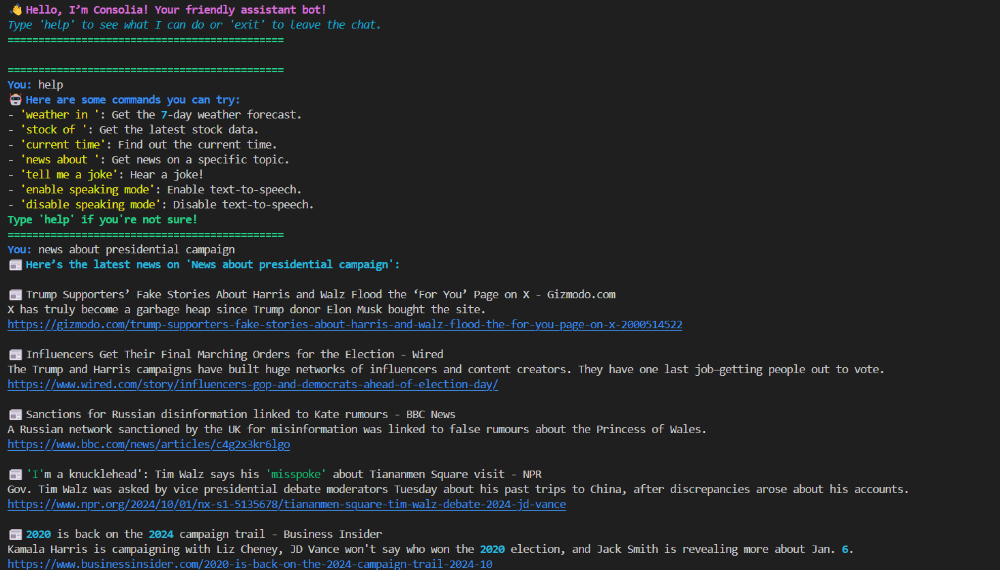

# Consolia - Terminal Communication Hub

Consolia is a terminal-based communication platform that centralizes email management, social media feeds, and a chatbot assistant all within the command line. Manage your inbox, send emails, monitor social media, get weather forecasts, check stock prices, and even chat with an AI assistant.

## Features

- **Email Management**: Check, send, and organize emails using Gmail.
- **RSS Feeds**: View and manage RSS feeds for quick news access.
- **Stock and Weather**: Fetch the latest stock data and weather forecasts.
- **Chatbot Assistant**: Interact with an AI assistant for news, jokes, time updates, and more.
- **Favorites**: Mark emails and RSS entries as favorites for quick access.
- **Customizable Settings**: Set email signatures, favorites, and adjust speaking mode (TTS) in the chatbot.

## Installation

1. **Clone the Repository**
   ```bash
   git clone https://github.com/erdemonal11/Consolia.git
   cd consolia
   ```
2. **Ensure Python 3.7+ is Installed**
   
   Consolia requires Python version 3.7 or newer.

3. **Install Required Packages**

   Use the `requirements.txt` file to install all dependencies with:
   ```bash
   pip install -r requirements.txt
   ```

4. **API Requirements**

- **Gmail**: Requires an [App Password](https://support.google.com/accounts/answer/185833) for Gmail access.
- **News**: Requires a News API key from [NewsAPI.org](https://newsapi.org/) for fetching news data.

## Usage

Run the main application using:

```bash
python consolia.py
```

### Main Commands

- **Check Email**: Access your inbox, view details, and organize.
- **Send Email**: Compose new emails with an optional signature.
- **RSS Feeds**: Browse and manage feeds, add favorites, and read summaries.
- **Stock and Weather**: View stocks and get real-time weather for your location or any city.
- **Chatbot Commands**:
  - `weather in [city]` - Get a 7-day forecast for a specified city.
  - `stock of [symbol]` - Fetch stock data for a given symbol.
  - `news about [topic]` - Get the latest news on a topic.
  - `tell me a joke` - Hear a joke from the chatbot.
  - `enable/disable speaking mode` - Toggle text-to-speech mode for chatbot responses.

### Interactive Menus

Consolia guides you through each interaction with options menus. Use the numeric options or input commands as prompted.

## Images

Below are screenshots showcasing Consolia’s features and user interface.

1. **Application Welcome Screen**  
   

2. **Email Management**  
   

3. **RSS Feed Viewer**  
   

4. **Stock and Weather Updates**  
   

5. **Chatbot Interaction**  
   


